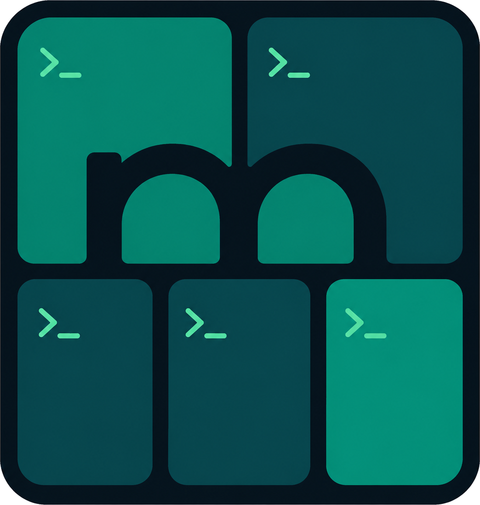

<p align="center">
  
</p>

<h1 align="center">mtmux</h1>

<p align="center">
  Every tmux session, local or remote, at your fingertips.
</p>

`mtmux` runs inside your existing terminal and works on top of tmux. No new terminal app, no replacement tmux setup, no retraining your keyboard muscle memory. Keep your terminal, tmux configuration, keybindings, plugins, and workflows while adding a persistent sidebar for finding, opening, and switching between sessions across your machine and SSH hosts. Your sessions remain ordinary tmux sessions; mtmux simply puts them within reach.

Star important sessions, see at a glance which ones need attention, and jump between local and remote work without hunting through terminal tabs.

## Why mtmux?

- **Keep your terminal and tmux setup**: unlike cmux, mtmux runs inside your current terminal and builds on tmux instead of forcing a new terminal app. Your configuration, keybindings, plugins, and workflows keep working.
- **One view across machines**: local and remote sessions live in the same sidebar.
- **Fast context switches**: see which sessions need your attention via tmux bells, then jump straight to them.

## Quick start

Requires Python 3.11+, tmux, and OpenSSH. Automatic coding-agent discovery additionally requires [astatus](https://github.com/julsemaan/astatus) locally and on configured remote hosts.

```sh
git clone https://github.com/julsemaan/mtmux.git
cd mtmux
pip install -e .
mtmux cockpit
```

That opens an outer tmux workspace with the mtmux sidebar on the left and your selected session on the right. Press `Enter` on a session to step into it; press `q` to close the sidebar, press `C-s s` whenever you want it back.

## Development

```sh
make dev-install
make test
```

## How it works

`mtmux cockpit` creates or attaches to a dedicated outer tmux server. That outer layer owns only the layout:

- outer prefix: `C-s`
- focus/open sidebar: `C-s s`
- outer status: off
- left pane: `mtmux` sidebar, 40 columns by default
- right pane: selected local/remote tmux attach client

Inner local and remote sessions keep their normal tmux prefix and remain alive when you switch away.

## Configuration

Files live in `~/.config/mtmux/`:

```toml
hosts = ["my-remote-machine"]
prefix = "C-s"
sidebar_width = 40
status_timeout = 5
persistent_ssh = true
```

### Prefix

`prefix` accepts one non-empty, printable tmux key token without whitespace. `sidebar_width` sets left pane width in columns. `status_timeout` controls how many seconds sidebar feedback remains visible. Both numeric settings must be positive integers. Restart sidebar by rerunning `mtmux cockpit` after changing these values.

`C-s` normally sends XOFF when terminal `IXON` flow control is enabled. Attached tmux disables flow control on outer tty, so outer prefix works without global `stty` changes. Readline, Emacs, or Vim `C-s` commands require `C-s C-s` to forward literal `C-s`; inner tty may still treat it as XOFF, in which case `C-q` resumes output.

To restore old prefix, set `prefix = "C-g"` and rerun `mtmux cockpit`.

### Remote hosts

Hosts are SSH aliases only. Keep host-specific users, ports, keys, proxies, IPv6, and other connection settings in `~/.ssh/config`.

By default, mtmux makes OpenSSH reuse one authenticated transport per host with `ControlMaster=auto`, `ControlPersist=10m`, and `ControlPath=~/.ssh/mtmux-%C`. Later discovery polls, switches, creates, and kills avoid repeating TCP setup, key exchange, and authentication. Control sockets remain for 10 minutes after last use.

To omit mtmux's persistence options, set:

```toml
persistent_ssh = false
```

SSH config still applies, so this opt-out does not disable multiplexing configured there.

Names of the hosts must match:

```text
[A-Za-z0-9_.-]{1,64}
```

## CLI commands

```sh
mtmux list
mtmux switch local:<session>
mtmux switch ssh:<host>:<session>
mtmux switch-star <1-9>
mtmux create local <session>
mtmux create ssh <host> <session>
mtmux kill local:<session>
mtmux kill ssh:<host>:<session>
```

Switching uses outer tmux `respawn-pane` on right pane. Real tmux sessions stay alive.

## Sidebar keys

- `C-s s`: focus sidebar; recreates it if quit
- `C-s 1`–`C-s 9`: switch directly to numbered starred target
- `j` / `k` or arrows: move selection pointer (`›`) in focused region
- `Tab`: switch focus between Sessions and Agents
- `[` / `]`: give Agents/Sessions region more rows for current run
- `Enter`: switch selected session or exact agent pane, open Add, or create on selected host line
- `a`: open grouped local/SSH Add picker
- `r`: remove selected target without killing it
- `K` / `J`: move selected starred target up/down without wrapping
- `x`: kill selected session but retain its star (asks first)
- `/`: open Add picker and filter unstarred sessions
- `?`: open help in right pane
- `q`: quit sidebar only

`›` marks keyboard selection; mint reverse highlight marks active cockpit session. Both appear independently while sidebar is focused. Unfocused sidebar hides pointer and keeps active session highlighted and visible.

Normal sidebar puts `Add session` first, followed by sessions in persisted order; no full-inventory duplicates or star glyphs. Independently navigable Agents region remains visible below `AGENTS` divider, including when empty. Add picker groups unstarred sessions under local and SSH hosts. Selecting or creating one stars it and switches immediately. First nine stars receive stable, right-aligned shortcut numbers; `K`/`J` updates order, while later stars remain sidebar-only. Prefix-number shortcuts load stars on every use, so changes apply without restart. Each star uses two rows: session name, then local hostname or SSH host. Missing stars remain launchers: `Enter` uses tmux `new-session -A` to recreate and attach. Favorites persist in `~/.config/mtmux/stars`. Only starred sessions trigger sidebar bell indicators and beeps. Set `MTMUX_ASCII=1` for text-only source labels and ellipses.

Agent records are read from `$AGENT_STATUS_DIR`, `$XDG_STATE_HOME/agent-status`, or `~/.local/state/agent-status`, in that order. Local and remote running agents updated within 60 seconds are correlated by exact tmux socket and pane ID. Selecting agent navigates to exact server, window, and pane. Task state stays visible as text and receives semantic color; attention states remain bold and idle/canceled remain dim without color. Agents are discovered automatically and cannot be added, removed, reordered, or killed as favorites.

## Mouse controls

- click session row: select and switch
- click available host row: select and open creation prompt
- wheel over sidebar: navigate selectable session and host rows
- right-pane mouse events: forwarded by outer tmux to mouse-aware applications
- live border dragging: disabled so text selection can cross the sidebar divider without resizing it

Resize the sidebar with standard tmux `C-s C-Left` / `C-s C-Right` bindings. Tmux mouse capture may require holding `Shift` for terminal-native text selection.

## Clipboard

Native tmux copy mode forwards copied text through nested sessions using OSC 52. Physical terminal must support and enable OSC 52 clipboard access. mtmux declares inner clients as `clipboard` capable and sets outer server option `set-clipboard on`; inner tmux configuration remains unchanged, including explicit `set-clipboard off`.

**Security:** `set-clipboard on` permits processes in local and remote panes to set system clipboard through OSC 52. Only connect to trusted hosts and run trusted pane processes.

## Recovery

Press `C-s s` or rerun:

```sh
mtmux cockpit
```

It reuses valid cockpit, repairs broken window, and respawns missing sidebar.

Missing cockpit for switch/create prints:

```text
No valid mtmux cockpit. Run: mtmux cockpit
```
